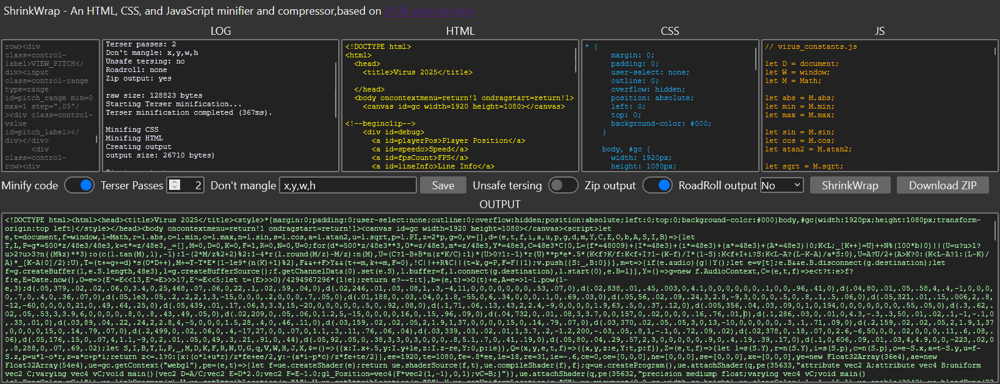

# ShrinkWrap



## What is it?

ShrinkWrap is based on the fantastic [Js13k Pack, by Xem.](https://github.com/xem/js13k-pack)

It takes an HTML file, loads all of it's embedded and linked CSS, JavaScript, and Image files, uses Terser to minify the JavaScript, minifies the HTML and CSS internally, then Runs it all through RoadRoller. It also creates a zip file from the resulting index.html, and associated images.

## How to use it

Using ShrinkWrap is kind of janky but once you "embrace the jank", you'll be fine.

ShrinkWrap will load files from your projects folder so ShrinkWrap needs to be run as a web page. I personally use the Live Server extension for Visual Studio Code, but you could use any other such extension you like.

There's no fancy npm istalling, just copy the shrinkwrap folder into your projects folder, and run it as a web page.

Paste your HTML into the input box on the left and ShrinkWrap will load all of the linked and embedded files.

Fiddle with the settings and then click ShrinkWrap to begin the process.

Once your project has been ShrinkWrapped, you'll be presented with the results.

If you opted to zip the file up you can now click the download button to receive a submission ready zip file, containing a single HTML file, along with any linked images.

Images are not processed in any way by ShrinkWrap, it assumes that they have been optimized already.

## Features

ShrinkWrap has all of the functionality of Xem's JS13k Pack, with a few extras thrown in (besides the auto loading of linked resources).

## Removing blocks of text

ShrinkWrap can get rid of text by removing blocks of text between fixed tags.

This feature is good if you have lots of debug stuff scattered throughout your game. So in your HTML you might have debug sliders and labels, some styles for those in the CSS, and code to update them in the JavaScript. You can just leave them all there and ShrinkWrap will strip them out before minification begins.

For HTML, any text between `<!--beginclip-->` and `<!--endclip-->` will be removed.

For JavaScript, any text between `//beginclip` and `//endclip` will be removed.

For CSS, any text between `/*beginclip` and `/*endclip` will be removed.

The removal is global so you can have as many clip regions as you like.

## Mangling object properties

ShrinkWrap can perform a pseudo mangle of object properties using a simple replace method.

To use this feature ShrinkWrap assumes that the remap block is located at the very top of your JavaScript file.

The multi-line comment should start with `/*remap`. and ShrinkWrap will process each non empty line in that comment block, splitting each line using a comma delimiter, then replacing the all occurrences of the first string with the second string. For example:

```javascript
/*remap
_this,becomes_this
_someVeryDescriptivePropertyName,a
```

This has been implemented purely because I cannot or the life of me get Terser to accurately mangle object properties. It always seems to break the code entirely.

This remapping can be used to mangle any text inside the file really. I generally prepend a "_" character to each property I want mangled, just for safety.

Remapping will take place before any other minification so you can be sure your remaps won't affect that process or vice versa.

## Property Mangling Exclusion.

Sometimes, Terser can be a bit of an ass. Let's look at an example function that returns an object using the passed arguments:

```javascript
const newThing = (x, y, w, h) => ({
  x,
  y,
  w,
  h
});
```

By default, Terser will rejig the code like so:

```javascript
const newThing = (a, b, c, d) => ({
  x: a,
  y: b,
  w: c,
  h: d
});
```

Generally we would consider this unwanted behavior.

You can use the "Don't Mangle" text input to enter a comma separated value string containing the names of properties you don't want Terser to mangle.

So if you entered "x,y,w,h" in the text input, the resulting code would be as expected.

## Notes

ShrinkWrap was made by me for me. This is to say that I'm quite particular when it comes to formatting my HTML, CSS, and JavaScript. If you have really badly formed code then ShrinkWrap may throw an error.

I want to express my thanks to Xem for creating JS13k Pack, without that, ShrinkWrap would not exist.
